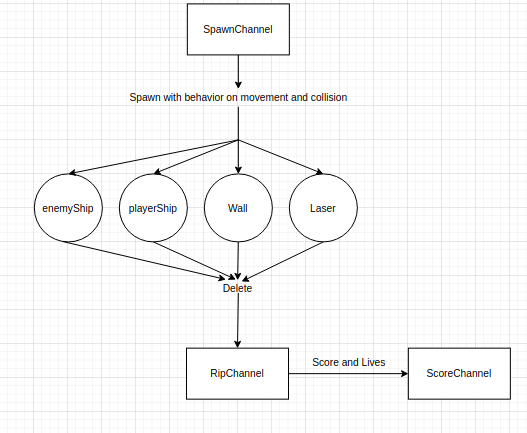

# Space Invaders: Architecture

The software consists in the use of goroutines that communicate in two different channels one for spawining and other for despawning. 

In the spawning channel, each object is set a rule of movement, position and what happens when another object collides with it.

The despawning channel (ripChannel) takes care of removing the object from the window and affecting either the score or the lives. 

There is also the childrenChannel withing the struct of an Enemy Spaceship that takes care of managing the movement on keyboard pressing. 

